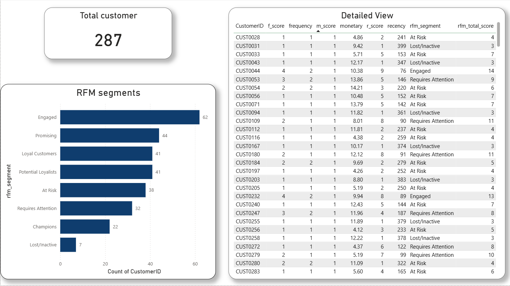

# 🧠 RFM Customer Segmentation Analysis

**Tools:** MySQL · Power BI  
**Skills:** Customer Analytics · SQL Views · Window Functions · NTILE Scoring · DAX · Data Visualization

---

## 📌 Project Overview

This project performs a full **RFM (Recency, Frequency, Monetary) analysis** on a print-shop's 2025 sales data to segment customers based on their purchasing behavior. The goal is to identify high-value customers, detect at-risk segments, and generate actionable insights through an interactive Power BI dashboard.

RFM is a proven marketing analytics framework that scores each customer across three dimensions:

| Dimension | Question It Answers |
|-----------|-------------------|
| **Recency** | How recently did the customer purchase? |
| **Frequency** | How often do they buy? |
| **Monetary** | How much do they spend in total? |

---

## 📂 Repository Structure

```
rfm-analysis/
│
├── rfm_analysis_sales_2025.csv          # Raw transactional sales data (994 orders)
├── RFM_analysis_queries.sql             # Full SQL pipeline (Views → Scoring → Segmentation)
├── RFM_Analysis.pbix                    # Power BI dashboard file
├── RFM_analysis_dashboard_screenshot.png  # Dashboard preview
└── README.md
```

---

## 📊 Dataset

**File:** `rfm_analysis_sales_2025.csv`

| Column | Description |
|--------|-------------|
| `OrderID` | Unique order identifier |
| `CustomerID` | Unique customer identifier |
| `OrderDate` | Date of the order (YYYY-MM-DD) |
| `ProductType` | Product category |
| `OrderValue` | Revenue from the order (£) |

**Dataset Stats:**
- 📦 **994** total orders
- 👥 **287** unique customers
- 🗓️ Date range: **Jan 2025 – Dec 2025**
- 🛍️ Products: Flyer, Canvas Print, Greeting Card, Business Card, Poster, Photo Book
- 💰 Average order value: **£17.17** | Max: **£48.00**

---

## 🔧 SQL Pipeline

**File:** `RFM_analysis_queries.sql`

The analysis is built in four layered SQL steps using **Views** for modularity and reusability.

### Step 1 — Compute Raw RFM Metrics (`salesmetrics` view)

```sql
CREATE OR REPLACE VIEW salesmetrics AS
WITH
  current_date_cte AS (SELECT CAST('2026-03-06' AS DATE) AS analysis_date),
  rfm AS (
    SELECT
      CustomerID,
      MAX(orderdate) AS last_order_date,
      DATEDIFF((SELECT analysis_date FROM current_date_cte), MAX(orderdate)) AS recency,
      COUNT(*) AS frequency,
      SUM(ordervalue) AS monetary
    FROM sales_2025
    GROUP BY CustomerID
  )
SELECT *, 
  ROW_NUMBER() OVER (ORDER BY recency ASC) AS r_rank,
  ROW_NUMBER() OVER (ORDER BY frequency DESC) AS f_rank,
  ROW_NUMBER() OVER (ORDER BY monetary DESC) AS m_rank
FROM rfm;
```

- `DATEDIFF` calculates how many days since each customer's last order
- `ROW_NUMBER()` ranks all customers per metric before scoring

---

### Step 2 — Assign Decile Scores (`rfm_scores` view)

```sql
CREATE OR REPLACE VIEW rfm_scores AS
SELECT *,
  NTILE(10) OVER (ORDER BY r_rank DESC) AS r_score,
  NTILE(10) OVER (ORDER BY f_rank DESC) AS f_score,
  NTILE(10) OVER (ORDER BY m_rank DESC) AS m_score
FROM salesmetrics;
```

- `NTILE(10)` divides customers into 10 equal buckets — **10 = best, 1 = worst**
- For Recency: lower days → better score, so `ORDER BY r_rank DESC` gives the freshest customers the highest score

---

### Step 3 — Combined Score (`rfm_total_score` view)

```sql
CREATE OR REPLACE VIEW rfm_total_score AS
SELECT CustomerID, recency, frequency, monetary,
  r_score, f_score, m_score,
  (r_score + f_score + m_score) AS rfm_total_score
FROM rfm_scores;
```

- Total score ranges from **3 (worst)** to **30 (best)**

---

### Step 4 — Segment Classification (`rfm_segments_final` table)

```sql
CREATE TABLE rfm_segments_final AS
SELECT ...,
  CASE
    WHEN rfm_total_score >= 28 THEN 'Champions'
    WHEN rfm_total_score >= 24 THEN 'Loyal Customers'
    WHEN rfm_total_score >= 20 THEN 'Potential Loyalists'
    WHEN rfm_total_score >= 16 THEN 'Promising'
    WHEN rfm_total_score >= 12 THEN 'Engaged'
    WHEN rfm_total_score >= 8  THEN 'Requires Attention'
    WHEN rfm_total_score >= 4  THEN 'At Risk'
    ELSE 'Lost/Inactive'
  END AS rfm_segment
FROM rfm_scores
ORDER BY rfm_total_score DESC;
```

**Segments defined (8 tiers):**

| Segment | Score Range | Description |
|---------|-------------|-------------|
| 🏆 Champions | 28–30 | Bought recently, buy often, spend the most |
| 💛 Loyal Customers | 24–27 | Regular buyers with strong spend |
| 🌱 Potential Loyalists | 20–23 | Recent customers with repeat potential |
| ⭐ Promising | 16–19 | Decent engagement, growing |
| 💬 Engaged | 12–15 | Average activity, need nurturing |
| ⚠️ Requires Attention | 8–11 | Declining, need re-engagement |
| 🔴 At Risk | 4–7 | Once active, now fading |
| ☠️ Lost/Inactive | 3 | No recent activity |

---

## 📈 Power BI Dashboard

**File:** `RFM_Analysis.pbix`



The dashboard visualizes segment distribution and customer-level RFM scores to support marketing decisions.

**Key visuals include:**
- 📊 Customer count by RFM segment (bar chart) — Engaged leads with 62 customers, Champions at 22
- 📋 Detailed customer-level table showing all RFM scores, recency days, monetary value, and assigned segment
- 🔢 KPI card showing total customer count (287)

**Data flow:**  
`MySQL Views` → `rfm_segments_final` table → Power BI import → Dashboard

---

## 💡 Key Insights

- **Champions and Loyal Customers** represent the top revenue drivers and should be prioritized for retention programs and loyalty rewards
- **At Risk and Lost/Inactive** segments highlight customers who haven't returned — win-back campaigns with targeted discounts could recover revenue
- **Potential Loyalists** are a high-opportunity group — recently acquired customers who could be converted to loyal buyers with the right nudge

---

## 🚀 How to Reproduce

1. Import `rfm_analysis_sales_2025.csv` into a MySQL database as table `sales_2025`
2. Run `RFM_analysis_queries.sql` in sequence to create all views and the final segment table
3. Connect Power BI Desktop to the `rfm_segments_final` table
4. Open `RFM_Analysis.pbix` to explore the dashboard

---

## 🛠️ Tech Stack

| Tool | Purpose |
|------|---------|
| MySQL | Data storage, SQL views, window functions |
| Power BI Desktop | Dashboard and data visualization |
| CSV | Raw data source |

---

## 🔗 Connect With Me

[](https://www.linkedin.com/in/yuvan-shankar-j)
[](https://github.com/yuvan-1411)


